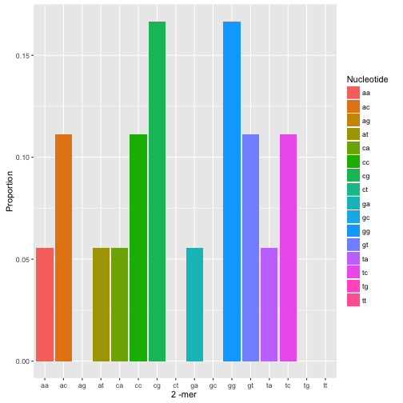
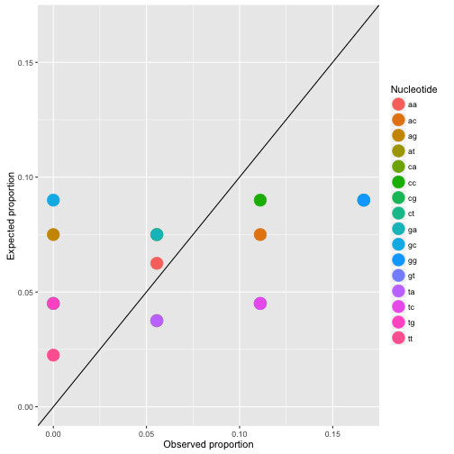

## DNA: brief introduction

DNA, or deoxyribonucleic acid, is the hereditary material 
in humans and almost all other organisms. 
 

-  Human DNA consists of about 3 billion bases, and more than 99 percent of those bases are the same in all people.
-  The information in DNA is stored as a code made up of four chemical bases: adenine (A), guanine (G), cytosine (C), and thymine (T). 
-  The order, or sequence, of these bases determines the information available for building and maintaining an organism, similar to the way in which letters of the alphabet appear in a certain order to form words and sentences.

--- .class #id 

## Base frequency
- seqinr is an R package for biological sequences retrieval and analysis


```r
library('seqinr')
```

- Use an example of a short piece of DNA sequence, saved as a vector of characters


```r
dna <- s2c("acgggtacggtcccatcgaa")
```
- The base composition of this sequence is:


```r
count(dna, word = 1)
```

```
## 
## a c g t 
## 5 6 6 3
```

---

## K-mer frequency

```r
k <- 2; kmer_count  <- count(dna, wordsize = k)
```


---&twocol  

## k-mer enrichment
*** =left
- Suppose the DNA sequence has length $L$
- Let $\# b$ be the number of occurrences of base $b\in \{A, T, G, C\}$ in the sequence 
- The expected occurrences of a k-mer $b_1\ldots b_k$ is : 
 $$L\times\prod_{i=1}^k p_{b_i}$$
 where 
 $p_{b_i} = \frac{\# b_i}{L}, b_i\in\{A, T, C, G\}.$
- Over-represented k-mers are above the diagnal line

*** =right
  

